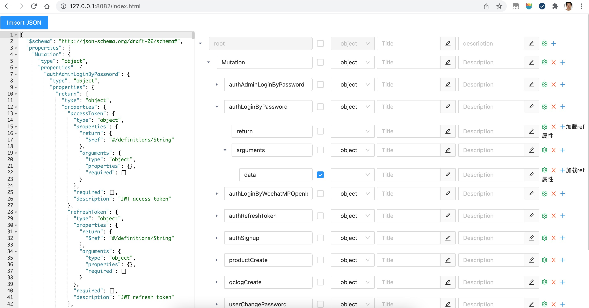

# json-schema-editor-visual

- A json-schema editor of high efficient and easy-to-use, base on React.
- 在[json-schema-editor-visual](https://github.com/Open-Federation/json-schema-editor-visual)基础上修改
- 增加了加载 ref 定义的功能 支持 JSON schema 的类型定义



## Usage
```
yarn add @leslieliu/react-jsonschema-editor
```

```js
import schemaEditor from '@leslieliu/react-jsonschema-editor/dist/main.js';
const SchemaEditor = schemaEditor({});

<SchemaEditor
  showEditor={true}
  isMock={false}
  data={''}
  onChange={(e) => {
    console.log('changeValue', e);
  }}
/>
```

## Links

https://github.com/liuwei0514/react-jsonschema-editor